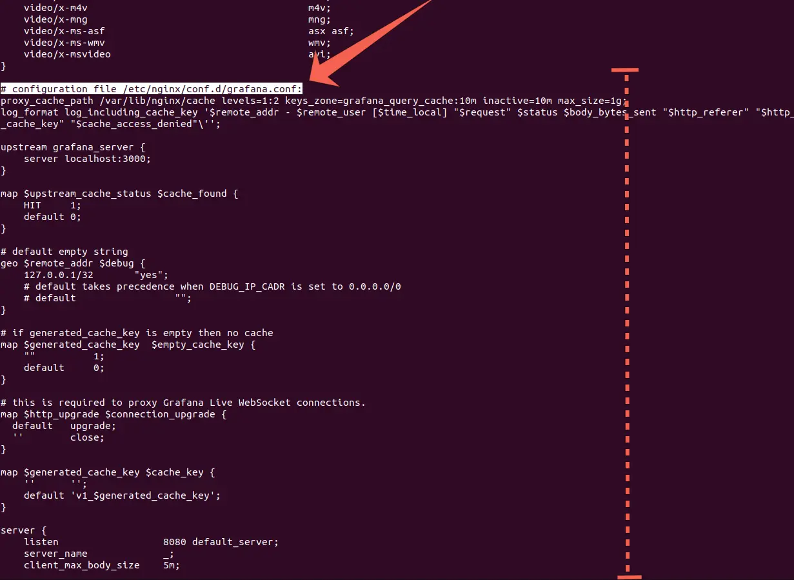

# Grafana Query Cache

Grafana Query Cache is an Nginx-powered proxy that accelerates dashboard loading and reduces data source load by caching query results.

## Key Features:

**High-Performance Caching**: Leverages Nginx's performant proxy cache for fast query response retrieval.


**Reduced Data Source Load**: Grafana Query Cache handles duplicate queries by forwarding only the first to Grafana and serving subsequent identical requests directly from its cache, significantly reducing the load on your data source."

**Configurable Caching**: Tailored to Your Needs

* Lua-powered cache key generation for precise control over caching behavior.
* Define cache lifecycle:
  * Set `MAX_INACTIVE_TIME` to control how long cached items remain valid without access.
  * Set `CACHE_EXPIRE_TIME` to enforce a maximum lifespan for cached items.
* Customize query grouping:
  * Use `ACCEPTABLE_TIME_DELTA_SECONDS` for queries with similar end times.
  * Use `ACCEPTABLE_TIME_RANGE_DELTA_SECONDS` for queries with similar time ranges.
  * Use `ACCEPTABLE_MAX_POINTS_DELTA` for queries with similar numbers of data points.
  * Example: With `ACCEPTABLE_TIME_DELTA_SECONDS`=600, identical queries spanning 06:00 to 06:10 will share a single cache entry, optimizing resource usage.

## Getting Started:


### Using Docker
To test Grafana Query Cache locally without a complex network setup, utilize Docker's host network mode for a streamlined experience.
```bash
docker run -it --network host \
  -e GRAFANA_SCHEME=http \
  -e GRAFANA_HOST=localhost:3000 \
  -e LISTEN=8080 \
  rishabhveer/grafana-query-cache:latest
```
Grafana should be accessible on [http://localhost:8080/](http://localhost:8080/)


### Using Docker Compose
Integrate Grafana Query Cache by adding the following service to your Docker Compose configuration: 
```yaml
services:
  grafana-query-cache:
    image: rishabhveer/grafana-query-cache:latest
    environment: 
      GRAFANA_SCHEME: http
      GRAFANA_HOST: grafana:3000
      LISTEN: 8080
    ports:
      - "8080:8080"
    # dependency on grafana (recommended)
    # depends_on:
    #   grafana:
    #     condition: service_healthy
```

### Integrating Grafana Query Cache into Your Existing Nginx Setup

**Prerequisites:**
* Nginx with Lua support: Please make sure your Nginx installation includes Lua capabilities.
* Lua md5 package: Install the Lua md5 package, available at https://lunarmodules.github.io/md5/.

**Steps:**
1. Obtain grafana_request.lua:

    Download the grafana_request.lua file from https://github.com/rishabhkailey/Grafana-Query-Cache/blob/main/grafana_request.lua.
2. Place grafana_request.lua:

    Copy the downloaded grafana_request.lua file into a directory within your Nginx's LUA_PATH.
3. Generate Nginx configuration:
    
    Execute the following command to generate the necessary Nginx configuration:
    ```bash
    docker run -it --network host \
      -e GRAFANA_SCHEME=http \
      -e GRAFANA_HOST=localhost:3000 \
      -e LISTEN=8080 \
      rishabhveer/grafana-query-cache:latest \
      /opt/entrypoint.sh test -v
    ```
    > Note: Adjust environment variables in the above command to match your specific deployment needs.

4. Locate generated configuration:

    Find the generated configuration in the output under the comment `# configuration file /etc/nginx/conf.d/grafana.conf`.

    

5. Incorporate configuration:

    Integrate the generated configuration into your Nginx setup by placing it within your /etc/nginx/conf.d directory.
6. Restart Nginx:

    After adding the configuration, restart Nginx to apply the changes.


## Supported Environment variables
| Environment Variable | Default Value | Description |
| -- | -- | -- |
| GRAFANA_HOST   | `localhost:3000`   |  Specifies the hostname and port of the upstream Grafana instance to connect to.  |
| GRAFANA_SCHEME | `http` | Sets the communication protocol (HTTP or HTTPS) for interacting with Grafana. |
| MAX_CACHE_SIZE | `1g` | Determines the maximum size of the cache storage, limiting the amount of data that can be cached.  |
| KEY_ZONE_SIZE | `10m` | Allocates the amount of shared memory used to store cache keys and metadata, managing cache organization and retrieval efficiency. |
| MAX_INACTIVE_TIME | `10m` | Configures the cache eviction policy, removing cached items that haven't been accessed within the specified time, even if they haven't expired based on their freshness. |
| CACHE_EXPIRE_TIME | `60m` | Sets the time duration after which cached items will automatically be considered expired and refreshed, ensuring data stays up-to-date. |
| CACHE_DIRECTORY | `/var/lib/nginx/cache` | Designates the file system directory where cached data will be stored. |
| CACHE_VERSION | `1` | Serves as a mechanism for cache invalidation. Updating this variable marks previously cached items as obsolete, prompting the retrieval of fresh data upon subsequent requests. However, the physical removal of old cached items occurs based on `MAX_INACTIVE_TIME` or `MAX_CACHE_SIZE` settings, ensuring efficient cache management. |
| SERVER_NAME          |  `_`               | Specifies the hostname or domain name that the server. this will be used in the nginx server directive.                           |
| LISTEN               | `80`                            | Sets the port number on which the server will listen for incoming connections. for ssl set it to `443 ssl`. this will be used by the nginx listen directive.                                        |
| SSL                  | `off`                           | Enables or disables SSL/TLS encryption for secure communication. Valid values are "on" or "off".                      |
| SSL_CERTIFICATE      | ""             | Path to the SSL/TLS certificate file, required when SSL is enabled.                                                   |
| SSL_CERTIFICATE_KEY  | ""             | Path to the SSL/TLS private key file, paired with the certificate for encryption.                                     |
| SSL_PROTOCOLS        | `TLSv1 TLSv1.1 TLSv1.2 TLSv1.3` | list of SSL/TLS protocols to support. Adjust based on security requirements and client compatibility. |
| SSL_CIPHERS          | `HIGH:!aNULL:!MD5`              | Specifies the allowed cipher suites for SSL/TLS connections, prioritizing strong ciphers and excluding weak ones.     |
| SSL_PASSWORD_FILE    | ""             | Path to a file containing the passphrase for an encrypted private key, required if the key is encrypted.              |
| CLIENT_MAX_BODY_SIZE | `5m`              | Sets the maximum allowed size of client request bodies, preventing excessive resource consumption.                    |
| DEBUG_IP_CADR | `127.0.0.1/32`              | Controls IPs receiving debug headers (X-Cache-Status, X-Cache-Key, X-Cache-Access-Denied). Set to 127.0.0.1/32 for local or 0.0.0.0/0 for all IPs. |
| MIN_REQUEST_COUNT | `2` | Defines the minimum request threshold for caching individual requests. Requests must exceed this threshold to become eligible for caching. Controls cache efficiency and prevents premature caching of infrequently accessed content. |
| ACCEPTABLE_TIME_DELTA_SECONDS | `1799` | Determines the size of time-based buckets for caching. Requests within the same bucket (up to 1799 seconds apart) will share a cache key and value. |
| ACCEPTABLE_TIME_RANGE_DELTA_SECONDS | `599` | Determines the size of time range-based buckets for caching. Requests with overlapping time ranges within the bucket (up to 599 seconds apart) will share a cache key and value. | 
| ACCEPTABLE_MAX_POINTS_DELTA | `259` | Determines the size of data points-based buckets for caching. Requests with data point differences within the bucket (up to 259 points apart) will share a cache key and value. |


## Key Considerations 
* User Access Verification: To ensure data security, Grafana Query Cache always verifies user access permissions with Grafana for each query request, even when serving from the cache. 
* Time Range Variability:
  * Be mindful of Grafana's potential time range variations of ±1 second.
  * To prevent cache misses due to this behavior, choose values for `ACCEPTABLE_TIME_RANGE_DELTA_SECONDS` that don't evenly divide common time ranges used in your Grafana dashboards. For instance, consider using 599 instead of 600.
  * This ensures consistent cache keys for queries with slightly differing time ranges, maximizing cache efficiency.

## Ideal Scenarios for Caching:

* **Relatively Static Data**: Maximize cache efficiency by using it for data sources that don't experience frequent updates.
* **High User Volume**: Effectively handle large numbers of concurrent users with the cache, reducing the load on your data source.
* **Resource-Intensive Queries**: Optimize performance for expensive or time-consuming queries by caching their results.

## When to Avoid Caching:

* **Highly Dynamic Data**: For data sources with frequent updates or real-time monitoring needs, caching might lead to outdated information and is generally not recommended.


## Supported Data Sources
Ideally, Grafana Query Cache should support any data source that utilizes [Grafana's Data Source Query API](https://grafana.com/docs/grafana/latest/developers/http_api/data_source/#query-a-data-source).

### Tested and Verified Data Sources:
* Prometheus
* Timescale/Postgres

